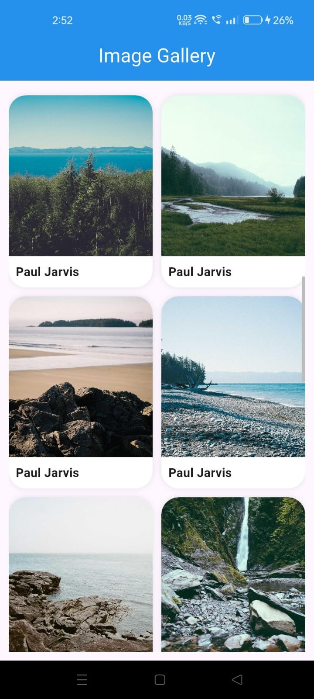
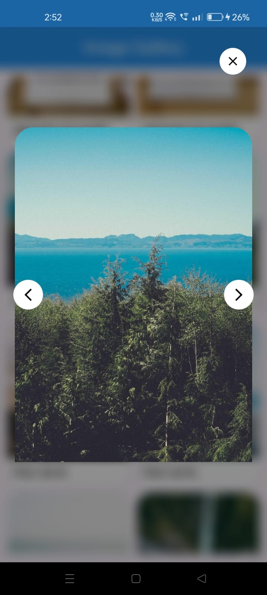

# Flutter Image Gallery

A modern Flutter image gallery app that fetches and displays images from the Picsum Photos API.

## Features

- Fetch images from REST API
- Responsive grid layout
- Smooth image loading indicators
- Pull to refresh functionality
- Interactive image popup viewer
- Blurred background popup effect
- Previous and next image navigation
- Scrollbar support
- Clean and modern UI

## API Used

https://picsum.photos/v2/list

## Tech Stack

- Flutter
- Dart
- HTTP package

## Getting Started

### 1. Clone the repository

```bash
git clone https://github.com/abs004/Flutter-image-gallery.git
```
### 2. Open project folder
```
cd flutter_image_gallery
```

### 3. Install dependencies
```
flutter pub get
```

### 4. Run the application
```
flutter run
```


## Screenshots

<table>
  <tr>
    <td align="center">
      
      <br/>
      <b>Home Screen</b>
    </td>
    <td align="center">
      
      <br/>
      <b>Image Viewer</b>
    </td>
  </tr>
</table>